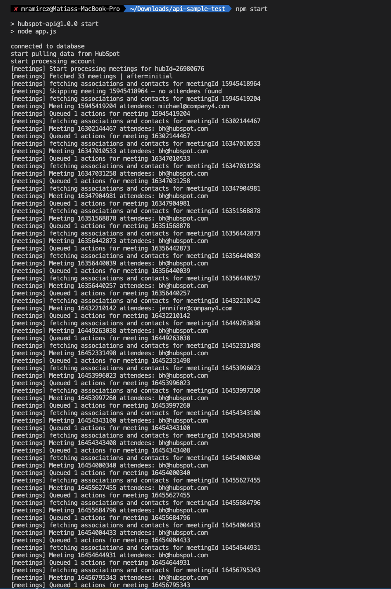
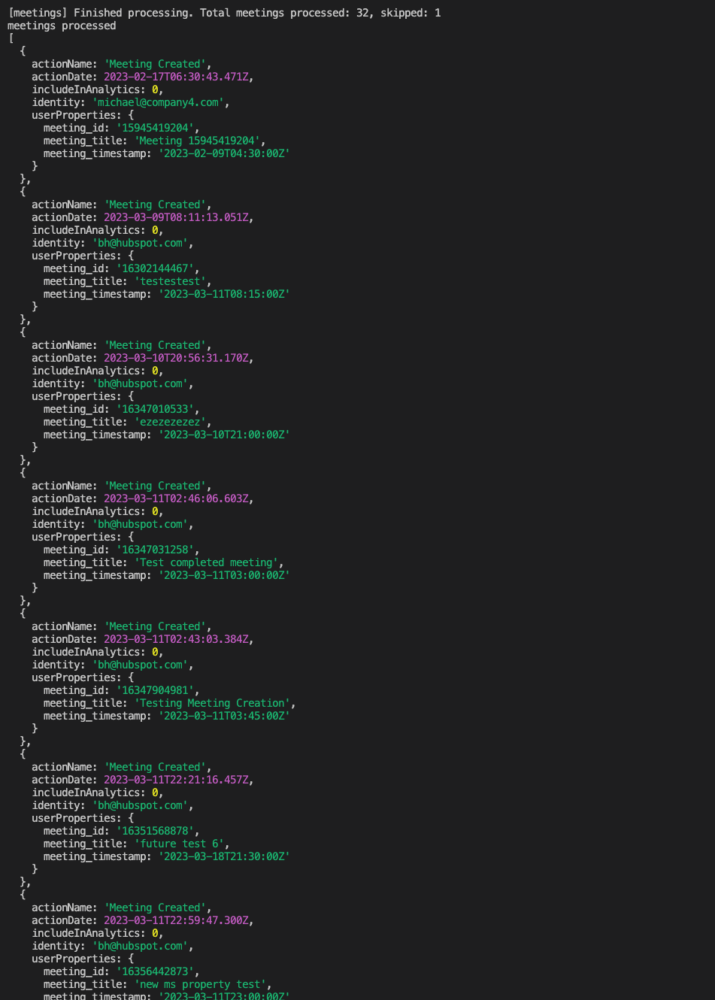

# HockeyStack Take home assessment Matías Ramirez

# Instructions to run
```bash
# Install the dependencies
npm i

# Create the .env file from its example
cp .env.example .env

# Replace this 3 variables in .env with the actual values
MONGO_URI=REPLACE_ME
HUBSPOT_CID=REPLACE_ME
HUBSPOT_CS=REPLACE_ME

# Start the process
npm start
```

# Pre-requisites
NodeJS ≥ 20

# Example working in console



# Debrief

This project has some significant tech debt that could be improve to increase the code quality and therefore performance and maintainability:
* All the logic is in a single large file, which is not good for readability and maintainability, the responsibilities should be split in different modules
* The `expirationDate` is defined as a global variable, breaking encapsulation. This will lead to race conditions or incorrect behavior when processing multiple accounts in parallel.
* From a performance standpoint, the system processes accounts sequentially, which causes the total runtime to grow linearly with the number of accounts. A better approach would involve parallelizing the processing using worker threads or a task queue.
* HubSpot API logic is spread throughout the worker and should be abstracted into a dedicated service or data layer to improve testability and separation of concerns.
* The access token refresh logic is unreliable, it should be based on catching 401 Unauthorized responses rather than comparing the current time to a shared expirationDate.
* The retry mechanism is naive: it can delay for up to 80 seconds on repeated failures, lacks visibility into retries, and doesn't handle specific HubSpot rate limits (like 429 status codes) gracefully.
* There are anti-patterns such as mutating arrays while iterating over them (e.g., contactsToAssociate.splice(...)), which can introduce subtle bugs.
* The current queue logic allows 2000 items to accumulate in memory before flushing, which can lead to memory issues and lacks proper rate control, this could be solved by using a producer/consumer model with a message broker like Kafka or RabbitMQ.
* The code mixes async/await with .then() promises (e.g., in refreshAccessToken), which is inconsistent and harder to reason about. It should be standardized to a single async style (I'd chose async/await due to readability).
* Logic for processing objects (companies, contacts, and now meetings) is largely duplicated. This could be refactored into a generic handler that receives the object type and configuration to reduce code repetition.
* Variable and function names lack clarity. For instance, `goal()` gives no indication of what it does, and short variables like `q` and `a` make the code harder to follow. More descriptive naming would significantly improve developer experience.
* One more improvement I'd do is add a robust logging lib as winston and send the logs like JSON as it makes things easier to integrate with tools like data dog and then query the logs by JSON properties.
* Last but not least, add strong unit tests to check the logic is not broken when doing changes and make the system more robust.
